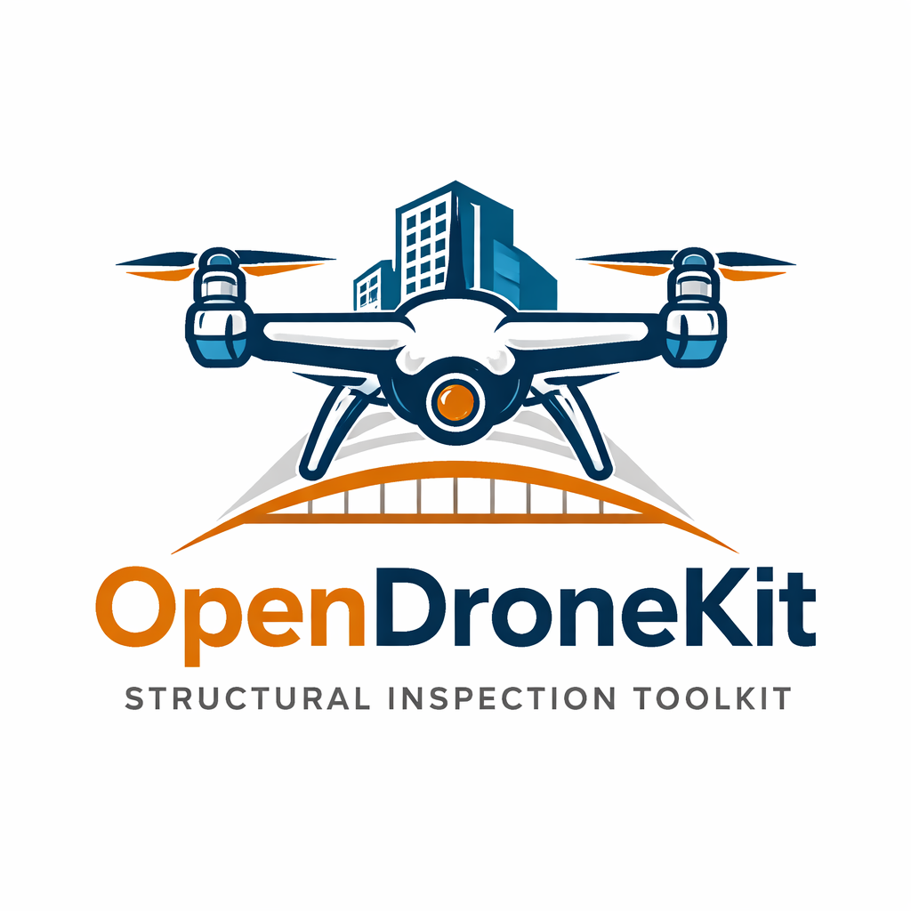

# OpenDroneKit



Offline-first drone inspection and geospatial toolkit: plan repeatable inspection
missions, fly them over MAVLink, then turn the imagery into georeferenced
reconstruction products and defect analytics.

Built for GIS / geomatics work — outputs land in a real coordinate reference system
and open directly in QGIS.

## What it does

**Mission planning** — 16 templates (grid, double grid, corridor, facade, tower, solar,
orbit, panorama, 360 bubble, waypoints, roof, linear, lateral, magnetic, linked, adaptive)
with real constraint geometry: ray-cast geofence containment, no-fly polygons with
segment-level detour insertion, altitude bands, standoff, and RTH rules.

**Terrain-aware planning** — AGL/AMSL follow modes with terrain loaded from GeoTIFF,
ESRI ASCII grid, CSV samples, or a fitted plane. Slope-normal gimbal attitude and
crosswind/headwind speed penalties.

**Flight** — MAVLink upload carrying yaw, gimbal pitch, dwell, and camera triggers, plus
geofence and rally points. Live telemetry, arm / start / pause / RTL / abort.

**Reconstruction** — COLMAP structure-from-motion with bundle adjustment, camera
intrinsics from an EXIF sensor database, and georeferencing solved as a RANSAC Helmert
similarity between recovered camera centres and image geotags. Outputs a
Cloud-Optimized GeoTIFF orthomosaic, DSM, DTM, and hillshade in the automatically
selected UTM zone, plus a point cloud, Poisson mesh, and camera-track GeoJSON.

**Analysis** — coverage QA, crack / structural / solar / corrosion detection, Paris-law
crack propagation, asset health scoring, and back-projection of 2-D defects onto the
reconstructed surface to produce georeferenced defect polygons with square-metre areas.

**Export** — QGroundControl `.plan`, QGC WPL `.waypoints`, DJI WPML `.kmz`, Litchi CSV,
KML, GeoJSON, and Cloud-Optimized GeoTIFF.

## Quick start

```bash
pip install -r requirements.txt
python main.py
```

The desktop shell uses the operating system's built-in webview (Edge WebView2 on
Windows), with a native menu bar and a MapLibre GL map canvas. There is no bundled
browser and no Qt dependency.

Command-line pipeline:

```bash
python run_pipeline.py --images <dataset_dir> --engine colmap --output final_toolkit_outputs
```

Useful flags: `--engine {auto,colmap,custom}`, `--dense` / `--no-dense`, `--epsg <code>`,
`--recon-profile {fast_preview,standard,inspection_high_accuracy}`.

## Repository layout

```
main.py                  desktop entry point
run_pipeline.py          CLI pipeline
app/                     desktop shell (window, menu, JS bridge, web UI, SQLite store)
core/                    geo, reconstruction, detection, propagation, reporting, flight
mission/                 mission planner and exporters
models/                  model registry and provenance
training/                dataset fetchers and training scripts
```

## Current capabilities and limits

This section states what actually works in this build.

| Area | State |
|---|---|
| Mission planning and constraints | Working, verified against drawn geometry |
| Mission export (5 formats) | Working; QGC WPL round-trips through pymavlink |
| COLMAP SfM + georeferencing | Working. Verified on the OpenDroneMap Aukerman survey: 77/77 images registered, 1.27 px mean reprojection error, geo RMSE 1.22 m, EPSG:32617 |
| Georeferenced COG outputs | Working (orthomosaic, DSM, DTM, hillshade) |
| Dense MVS | **Requires a CUDA COLMAP build.** The pycolmap wheels are CPU-only, so dense stereo is skipped and raster resolution is reduced to what the sparse cloud supports. The run reports this explicitly. |
| Trained defect models | **No weights are installed.** Detection falls back to classical image processing and reports `model_used` as `heuristic`, never as AI. See below. |
| Cloud reconstruction | Not implemented. Requesting it runs locally and says so; no data leaves the machine. |
| GUI flight control | Real MAVLink commands when a MAVLink driver is connected. A `mock` driver is also selectable and is always labelled SIMULATED in the UI. |

## Model assets and licensing

`models/model_registry.json` lists the model keys the pipeline looks for.
`models/manifests/model_provenance.json` records what is actually installed.

**At present no weights ship with this repository.** A previous manifest listed four
ONNX targets sharing a single checksum — one concrete-defect model copied under solar
and CODEBRIM filenames. Those entries have been retracted rather than corrected.

To train real weights, see `training/`:

```bash
python -m training.datasets.download --list     # catalogue and credential status
python -m training.datasets.download public     # no account needed
python -m training.datasets.download crack solar structural corrosion
```

Kaggle datasets need `KAGGLE_API_TOKEN` (or `~/.kaggle/access_token`); Roboflow needs
`ROBOFLOW_API_KEY`. Each dataset's licence is recorded in the catalogue and written to
`training/data/manifest.json` on download.

Licensing rules for anything produced here:

- Record the true source, licence, and sha256 of every shipped weight file.
- Do not redistribute weights whose source licence is absent or incompatible.
- ELPV is CC BY-NC-SA 4.0, so models trained on it must not be shipped commercially.

## Outputs

Written under `final_toolkit_outputs/` by default:

```
summary.json                 run manifest
inspection_report.md         generated report
reconstruction.ply           point cloud
mesh.ply / mesh.obj          Poisson surface
orthomosaic.tif              georeferenced COG
dsm.tif / dtm.tif            elevation COGs in metres
dsm_hillshade.tif            shaded relief
camera_track.geojson         camera positions with GPS residuals
geo_anchor.json              similarity transform and fit quality
digital_twin.json            artifact index and run metadata
```
